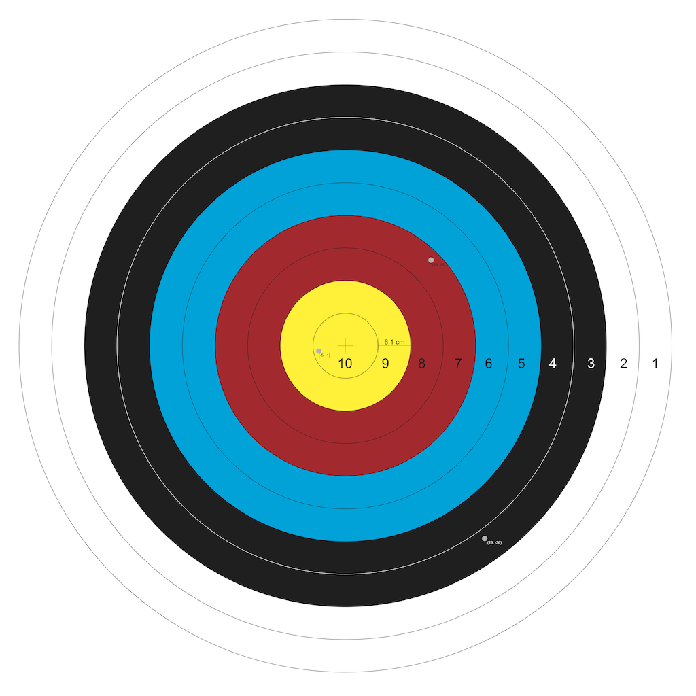

# CSC 1019 Practice 01
Archery is an olympic sport where competitors shoot arrows at a target with a bow. The target is made up of 10 concentric circles. The radius of the innermost circle is 6.1 cm. Each circle has a radius that is 6.1 cm greater than the circle it surrounds, so the outermost circle has a radius of 61 cm. 

In an individual round, a competitor shoots three arrows. If the arrow hits in the innermost circle, the competitor scores 10 points, if it lands in the next circle, the competitor scores 9 points, and so on. The sum of the three points determines the score.

This target can be laid on a coordinate grid, where the middle is the origin, and each point represents one centimeter. For example, the point (16, 16) is 16 cm to the right of the origin and 16 cm above it, which is in the fourth circle, scoring 7 points. If the arrow touches a line, the higher score is earned.

Your task is to take three arrow coordinates and turn them into a total score.

## Input
The input to this program will be on the console. It will consist of three points, one line per point, and the x and y coordinates will be separated by a space. The values can range from -61.0 to 61.0, and they can be fractional.

### Example
```
16 16
26 -36
-5 -1
```

## Output
The output should consist of one line, which represents the total score earned by the three points.

### Example

`20`

## Illustrated Example
In the example image below, three arrows hit at the following points:
```
(16, 16): 7
(26, -36): 3
(-5, -1): 10
Total Score: 20
```


## Task
In `archery.py`, write Python code that will accept the inputs and generate the correct output **exactly as specified in the problem statement**. Make sure you test along the way. Also make sure that you answer the questions in the REFLECTIONS.md file.

Every time you commit, the autograder will run.